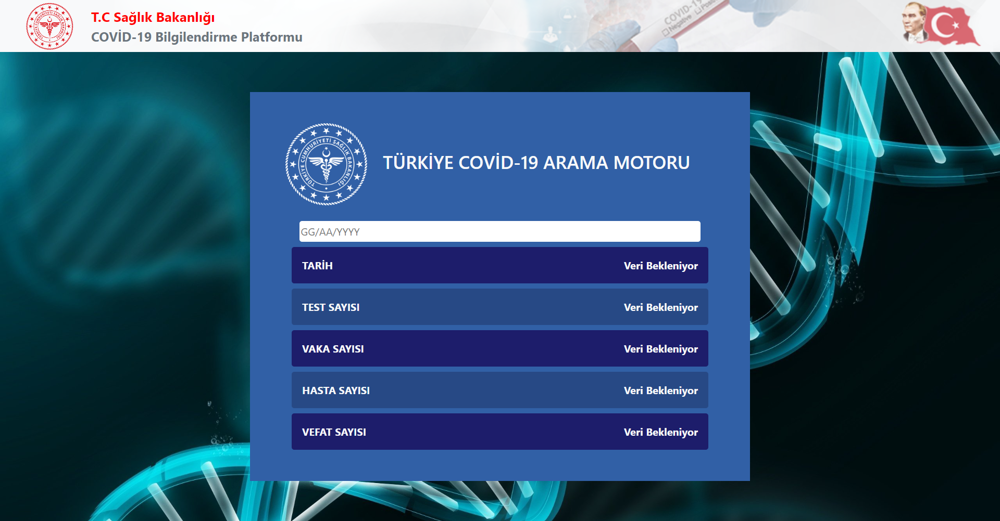

# About The Project

Project showing Covid-19 data in Turkey. It displays data on the screen by pulling data through the API according to the date. 

## Images

### Home Page

## Start The Project

For installing 'npm' files in the project
### `npm install`

To get the project up and running
### `npm start`

## Languages and Libraries

<li>CSS
<li>Bootstrap
<li>Javascript
<li>ReactJS

## Contact

Oğuz Adıgüzel [Linkedin](https://www.linkedin.com/in/oğuz-adıgüzel-2672a8242). - oguz_adiguzel@outlook.com

Project Link : [https://github.com/oguz-adiguzel/Turkey-Covid-19-Search-Engine](https://github.com/oguz-adiguzel/Turkey-Covid-19-Search-Engine).

Vercel Link : [https://turkey-covid-19-search-engine.vercel.app](https://turkey-covid-19-search-engine.vercel.app)